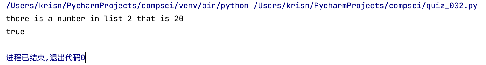

# Quiz 002

## Python Code
``` .py
#if either number from list a and b is 20 or the sum of either two numbers from each list is 20, print True
list_a=[10, 30, 10, 26]
list_b=[20, 15, 5, 6]
output=False

for a in list_a:
    if a==20:
        output=True
        print(f'there is a number in list 1 that is 20')

for b in list_b:
    if b==20:
        output=True
        print(f'there is a number in list 2 that is 20')

for a,b in zip(list_a,list_b):
    if a+b==20:
        output=True
        print(f'the sum of {a} in list 1 and {b} in list 2 is 20')


if output:
    print('true')
else:
    print('false')
```

## Flow Diagram


## Results 

