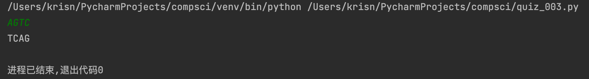

# Converting DNA Ques

## Python Code
```.py
in_protein= input()
out_protein=""

for i in in_protein.upper():
    if i=="A":
        out_protein=out_protein+"T"
    if i=="G":
        out_protein=out_protein+"C"
    if i=="T":
        out_protein=out_protein+"A"
    if i=="C":
        out_protein=out_protein+"G"

print(out_protein)
```

## Flow chart


## result



*figure 1* shows one result of the program
