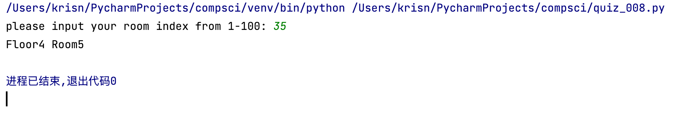

# Allocating rooms

## Code

```.py
index=int(input("please input your room index from 1-100: "))
if index<0 or index>100:
    index = int(input("please put a valid room index from 1-100: "))
for floor in range(1,11,1):
    for room in range(1,11,1):
        if index==(floor-1)*10+room:
            print(f'Floor{floor} Room{room}')
```
## Flow Diagram


## Tests:


