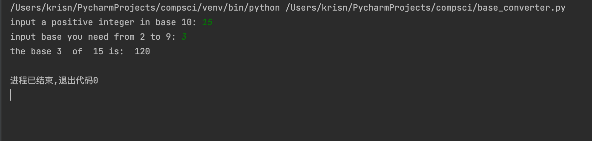
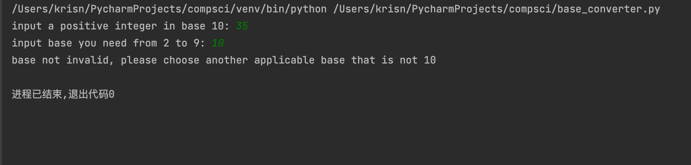
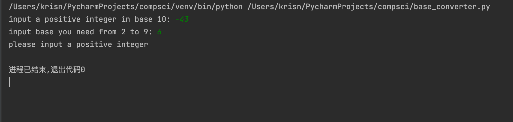

# Basic Base Converter(Array v1)
## Introduction

This is a basic base converter that converts a positive integer from Base 10 to Base 2-9 inclusive with an array written in python.

## Code Structrue
```.py

# base converter-Kris Ni
# this number converts positive base 10 integers to any base 2 to 9 integers.

num = int(input('input a positive integer in base 10: '))
base = int(input('input base you need from 2 to 9: '))
dev = int(num / base)
mod = num % base
out = mod
# initialize variables

i = 1
# initialize cursor

if num < 0:
    print('please input a positive integer')
    exit()
if base < 2 or base == 10:
    print('base not invalid, please choose another applicable base that is not 10')
    exit()
# check for invalid input and base.

while dev > base - 1:
    mod = dev % base
    dev = int(dev / base)
    out = out + mod * (10 ** i)
    i = i + 1
out = out + dev * (10 ** i)

# calculate

print("the base", base, " of ", num, "is: ", out)

# output

```
## Test results


*Fig.1*  **example of test result**

## Invalid situations


*Fig.2* **invalid base**


*Fig.3* **invalid input integer**
