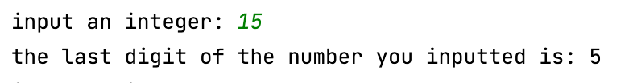
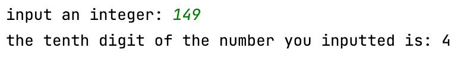

## Last digit

Given an integer number, print its last digit.

```.py
# Read an integer:
a = int(input("input an integer: "))
print("the last digit of the number you inputted is:", a%10)
``` 



**Fig. 1** This is the evidence 

## Tens

Given an integer. Print its tens digit.

```.py
# Read an integer:
number = int(input("input an integer: "))
number = number//10 # integer division
answer = number%10
print("the tenth digit of the number you inputted is:", answer)
```



**Fig. 2** This is the evidence 
