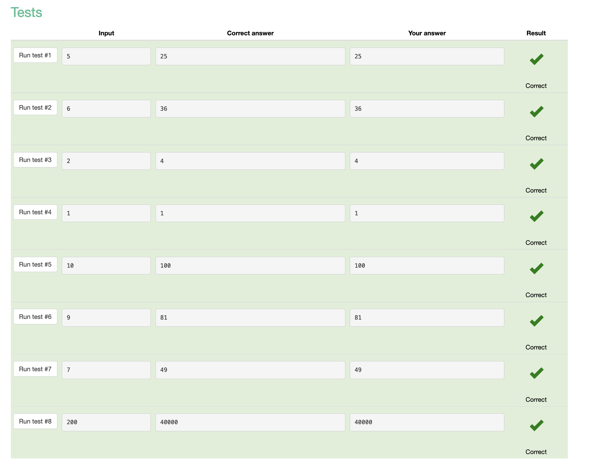

# Sum of three numbers

## Code
```.py
a = int(input())
b = int(input())
c = int(input())
print(a + b + c)
```

## Tests


# Hi John

## Code
```.py
name = input('What is your name?')  
print('Hi ' + name )
```

## Tests


# Square

## Code
```.py
a = int(input())
print(a**2)
```

## Tests



# Area of right-angled triangle

## Code
```.py
b = int(input())
h = int(input())
print(b*h/2)
```

## Tests


# Hello, Harry!

## Code
```.py
name = input()
print('Hello, '+name+'!')
```

## Tests


# Apple sharing

## Code
```.py
students = int(input())
apples = int(input())
print(apples // students)
print(apples % students)
```

## Tests


# Previous and next

## Code
```.py
a = int(input())
print('The next number for the number ' + str(a) + ' is ' + str(a + 1) + '.')
print('The previous number for the number ' + str(a) + ' is ' + str(a - 1) + '.')
```

## Tests


# Two timestamps

## Code
```.py
hour1= int(input())
minute1= int(input())
second1= int(input())
hour2= int(input())
minute2= int(input())
second2=int(input())

out= hour2*3600+minute2*60+second2-(hour1*3600+minute1*60+second1)

print(out)
```

## Tests


# School desks

## Code
```.py
a = int(input())
b = int(input())
c = int(input())

out= a//2 + b//2 + c//2 + a%2 + b%2 + c%2

print(out)
```

## Tests


