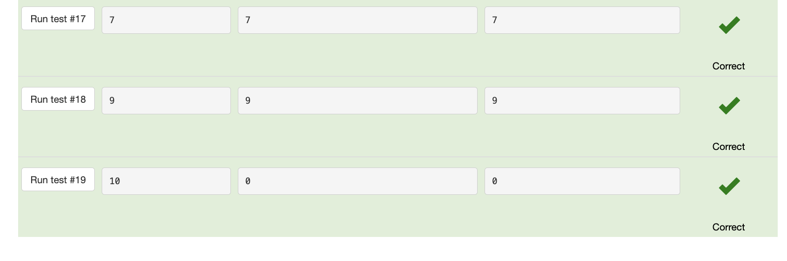
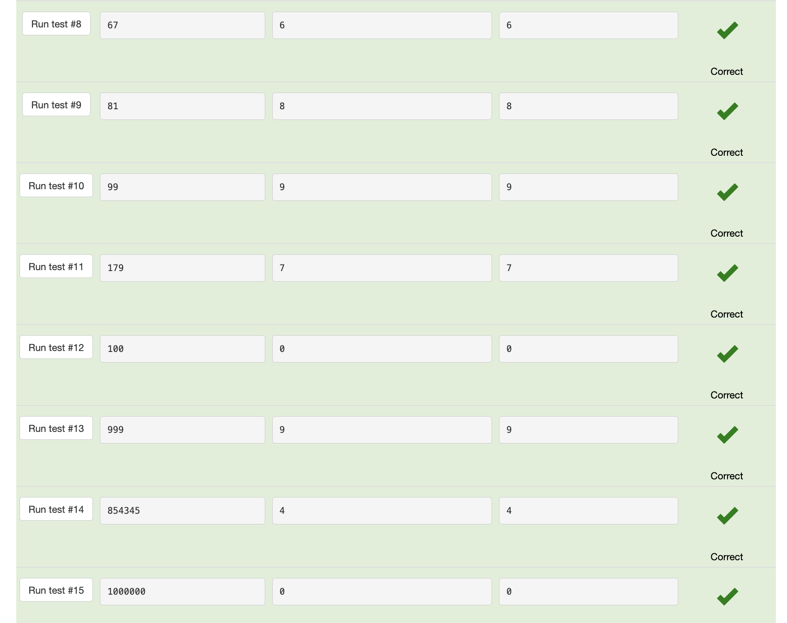
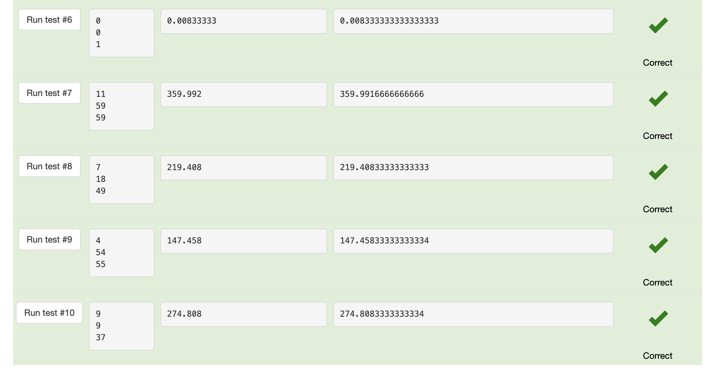

# Last digit of integer

## Code
```.py
a = int(input())
print(a%10)
```

## Tests




# Two digits

## Code
```.py
a = int(input())
first= int((a-(a%10))/10)
print(first,a%10)
```

## Tests


# Swap digits

## Code
```.py
a = int(input())
tenth= int((a-(a%10))/10)
one=a%10
print(str(one)+str(tenth))
```

## Tests


# Last two digits

## Code
```.py
a = int(input())
print(a%100)
```

## Tests


# Tens digit

## Code
```.py
a = int(input())
tenth= int(a//10 % 10)
print(tenth)
```

## Tests





# Sum of digits

## Code
```.py
a = int(input())
hundreds= int(a//100)
tenth= int(a//10 % 10)
one=a%10

print(hundreds+tenth+one)
```

## Tests


# Reverse three digits

## Code
```.py
a = int(input())
hundreds= int(a//100)
tenth= int(a//10 % 10)
one=a%10

print(str(one)+str(tenth)+str(hundreds))
```

## Tests


# Merge two numbers

## Code
```.py
a= int(input())
b= int(input())

a1= str(a//10)
a2= str(a%10)
b1= str(b//10)
b2= str(b%10)

print (a1+b1+a2+b2)
```

## Tests


# Cyclic rotation

## Code
```.py
a = int(input())
a1=a//100
a2=a%100

print(str(a2)+str(a1))
```

## Tests


# Fractional part

## Code
```.py
a = float(input())
dec=a%1
print(dec)
```

## Tests


# First digit after decimal point

## Code
```.py
a = float(input())
dec1=(a%1*10)//1

print(dec1)
```

## Tests


# Car route

## Code
```.py
from math import ceil
n = int(input())
m = int(input())
days=ceil(m/n)

print(days)
```

## Tests


#  Day of week

## Code
```.py
a = int(input())
day=(a-4)%7
print(day)
```

## Tests


# Digital clock

## Code
```.py
time = int(input())
hours= time//60
minutes= time%60

print(hours, minutes)
```

## Tests


# Total cost
a = int(input())
b = int(input())
n = int(input())

dollars = n*a + (n*b)//100
cents = (b*n) % 100

print(dollars, cents)
## Code
```.py

```

## Tests


# Century

## Code
```.py
from math import ceil

year = int(input())
cent = ceil(year/100)

print(cent)
```

## Tests


# Snail

## Code
```.py
from math import ceil

H = int(input())
a = int(input())
b = int(input())

days= ceil((H-a)/(a-b)+1)

print(days)
```

## Tests


# Clock face - 1

## Code
```.py
h = int(input())
m = int(input())
s = int(input())

degrees= (h + m/60 + s/3600)*30

print(degrees)
```

## Tests




# Clock face - 2

## Code
```.py
h=float(input())

print((h*12)%360)
```

## Tests


